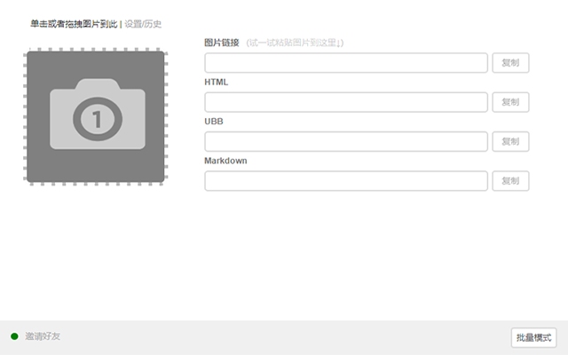
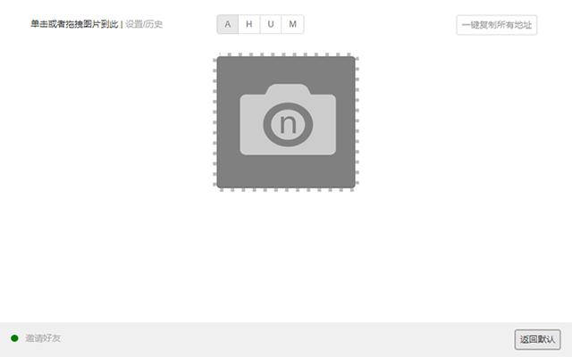
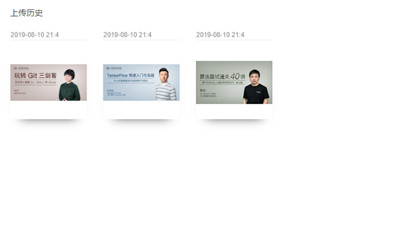

## 🚀 喔喔图床

作为一名IT民工，平时喜欢写一些文档，博客，并且比较喜欢 Markdown 语法，但一直以来比较困扰的一个问题就是插入图片麻烦，因为文档可能会放置到各个网站中，如何保证图片能够正常显示是一件头痛的事情。另外，图片上传要足够方便，正好 Chrome 插件能完全满足需求。

### 特点

- 支持点选/拖拽/本地粘贴3种方式上传图片至图床
- 支持右键上传网页图片
- 支持批量上传
- 可生成图片链接,HTML,UBB和Markdown四种格式
- 历史浏览（仅限浏览器本地缓存，清缓存将会失效）
- 支持配置多种存储后端（默认阿里云）
- 离线插件安装，免翻墙

好用记得给点好评哟。阔绰的小伙伴也可以打赏一下。打赏图在最下方，避免影响大家阅读。

> 单张上传



> 批量上传



> 上传历史记录



### 使用指南

使用图床分 3 步：

- 拥有 chrome 内核的现代浏览器（这个不多说了）
- 开通阿里云OSS 存储并获取 AK,SK
- 安装此插件并完成配置（配置域名，AK,SK）

#### 开通阿里云OSS

推荐采用 阿里云OSS 用于存储图片（个人可以注册阿里云账号，开通OSS，有免费额度，基本够用）

登录进入到控制台，搜索 对象存储。


Bucket 列表，创建 Bucket


填写必要的信息，选择开放公共读（重点）


进入到 Bucket 点击概览，可以看到外网访问点


这个访问点就是下面示例中提到的 upUrl 的一部分。

另外，还需要创建你的 AK, SK， 点头像 - AccessKey 管理，创建 AccessKey 并保存下来。


#### 安装插件并配置

下载最新完整代码并解压到磁盘某一位置（任何位置都可以）。

https://github.com/bytesops/oopic/archive/refs/heads/master.zip

如：E:\data\oopic-master


在浏览器地址栏中输入：chrome://extensions/

然后点击 加载已解压的扩展程序，选择 oopic-master 目录。


为了方便使用，可以将其固定至浏览器地址栏右侧。


然后单击图标，在弹出的上传页中，点击 设置/历史 进行插件配置。


配置上一节中获取的 阿里云OSS 接入点及你的 AK, SK


#### 使用交流

关注我的个人号“新质程序猿”回复“图床”即可获取交流群链接。


### 阿里云OSS扩展

阿里云OSS 上传采用 PostObject 模式，大家可以阅读具体的参数文档。

https://help.aliyun.com/document_detail/31988.htm

阿里云OSS需要绑定自定义域名后才能浏览器直接预览，否则会弹出下载，不过不影响作为图床的使用（使用阿里云自己的域名在网页中也可以显示，最下面的打赏链接就是用的aliyun的域名直接显示的）。

下面是我使用毕生JS绝学所写的 阿里云OSS 上传代码，仅供参考，上传参数大家可以微调。

```
// 我的 bucket 叫 oosnail, 位于 杭州区
upUrl = 'https://oosnail.oss-cn-hangzhou.aliyuncs.com/';
// ak,sk 你懂的，鉴权用的
var accessKey = 'ak';
var secretKey = 'sk';
// 构建可以访问的地址
function parseRet(text, formData) {
    return upUrl + formData.get('key');
}
// 构建上传表单
function buildForm(file) {
    var policyText = {
        "expiration": new Date((Date.now() + 300000)).toISOString(),
        "conditions": [
            ["content-length-range", 0, 104857600]
        ]
    };
    var policyBase64 = Base64.encode(JSON.stringify(policyText));
    var signature = CryptoJS.enc.Base64.stringify(CryptoJS.HmacSHA1(policyBase64, secretKey));
    var data = new FormData();
    var key = new Date().format('yyyy/MM/dd/h/') + random_string(6) + get_suffix(file.name);
    // 文件路径，我设置的类似 2025/05/21/sdfesd.png 这样的
    data.append('key', key);
    // 签名相关的，可以参照官方文档
    data.append('policy', policyBase64);
    data.append('OSSAccessKeyId', accessKey);
    data.append('success_action_status', '200');
    data.append('signature', signature);
    // 待上传的文件
    data.append('file', file);
    return data;
}
```


### 自定义扩展

有一定开发能力的可以根据其他存储进行扩展，提供如下资料：

- upUrl: 请提供您个人服务端上传接口完全路径，POST 表单上传
- buildForm(file): 构建表单参数方法，您可以填写个人自定义字段至form表单中
- parseRet(text, formData): 解析ajax响应内容，返回图片的完全访问路径用于快速复制及历史记录

```
// 上传接口
upUrl = 'https://yoururl';
// 构建form表单数据，file表示待上传的文件
function buildForm(file) {
    var data = new FormData();
    data.append('file', file);
    return data;
}
// 返回服务端响应的图片访问链接
function parseRet(text, formData) {
    var res = JSON.parse(text);
    var image_url = res.data;
    return image_url;
}
```

例如我个人还有一个 七牛云存储 的配置示例如下（七牛云现在没有免费域名绑定了，需要填写自己备案的域名才行）：

```
upUrl = 'https://upload.qiniup.com/';
var accessKey = 'ak';
var secretKey = 'sk';
var bucketHost = 'http://laijuba.qiniudn.com/';
function parseRet(text, formData) {
    var res = JSON.parse(text);
    var image_url = bucketHost + res.key;
    return image_url;
}
function buildForm(file) {
    var fileName = file.name;
    var flags = {
        deadline: Math.floor(Date.now() / 1000) + 300,
        scope: "laijuba",
        saveKey: "${year}/${mon}/${day}/$(etag)" + get_suffix(fileName)
    };
    var encodedFlags = urlsafeBase64Encode(JSON.stringify(flags));
    var encoded = CryptoJS.enc.Base64.stringify(CryptoJS.HmacSHA1(encodedFlags, secretKey));
    var encodedSign = base64ToUrlSafe(encoded);
    var uploadToken = accessKey + ':' + encodedSign + ':' + encodedFlags;
    var data = new FormData();
    data.append('token', uploadToken);
    data.append('file', file);
    return data;
}
```

### 打赏链接

<table border="0">
<tr>
<td></td>
<td></td>
</tr>
</table>

